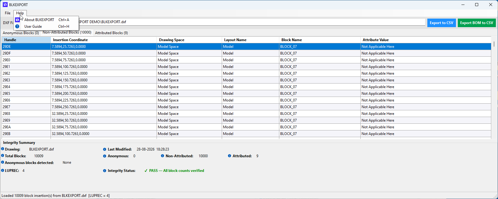
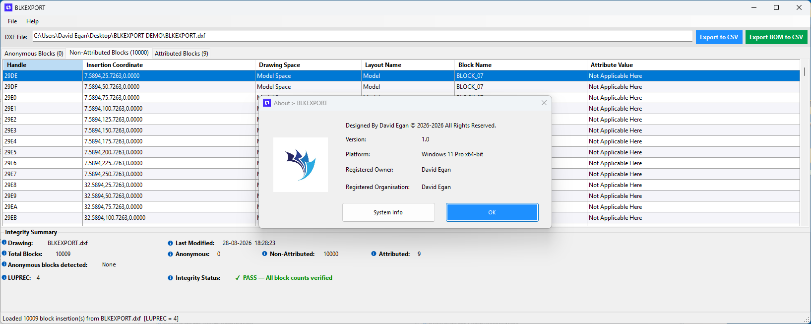
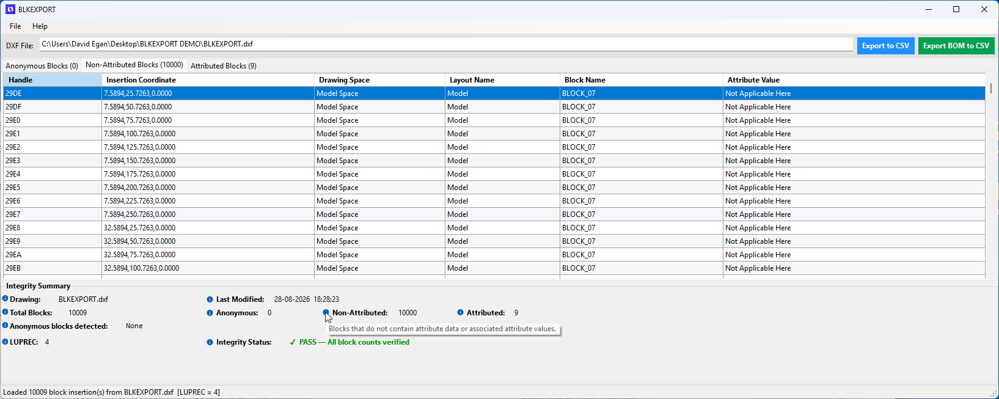

#  BLKEXPORT (Case Study – Proprietary Production Application)

BLKEXPORT is a bespoke C# WinForms desktop application developed to automate the generation of a Bill of Materials (BOM) from CAD drawings — a common but time-consuming workflow within the AEC (Architecture, Engineering & Construction) industry.

The application demonstrates this approach by parsing an AutoCAD 2018 DXF (ASCII or Binary) file into a single, streamlined desktop workflow. Once loaded, it inventories all block insertions, validates data integrity, and categorises them as Anonymous, Non-Attributed, or Attributed blocks.

The user can then export two distinct CSV outputs:

<b>1. Export to CSV</b> – Full Block Schedule with handle, insertion coordinate, drawing space, layout, block name and attribute data.

<b>2. Export BOM to CSV</b> – Consolidated Bill of Materials.

### Repository Scope
As BLKEXPORT was developed as a bespoke production development, its source code remains private. This repository therefore provides the supporting materials for the solution, including technical documentation, architecture overview, application screenshots, user guide, and video demonstration.


## At a Glance

✔ Winforms application
✔ Comprehensive documentation

# The problem

Generating a BOM from CAD drawings is typically still a manual process — the drawings are plotted, symbols are counted by hand using a highlighter, and the totals are recorded in something like an Excel spreadsheet. This remains the standard practice in most companies today.

# 🧭 BLKEXPORT (Case Study – Proprietary Production Application)
<i>BLKEXPORT allows the user to generate a BOM (Bill of Material) the quick and easy way.</i>
<p align="left">

</p>
💡 **Tip:** Click the hero image to view the full-size version.

---
<a id="enterprise-project"></a>

## 📑 Table of Contents

| 📖 Overview | 🛠️ Technical | 📚 Resources | 📈 About |
|:-----------:|:------------:|:------------:|:----------:|
| 🌐 [Platform Overview](#platform-overview) | ✨ [Key Features](#key-features) | 📦 [Contents](#repository-contents) | 📊 [Results](#results) |
| 💡 [Solution](#solution) | 🛠️ [Tech Stack](#tech-stack) | 📚 [Documentation](#documentation) | 🚦 [Project Status](#project-status) |
| 👥 [Who Is It For](#who-is-it-for) |🏗️ [BLKEXPORT Architecture](#enola-architecture) | 🖼️ [Screenshots](#screenshots-project-navigator--enola) | 👤 [Author](#author) |
| 🚀 [Why It's Better](#why-is-it-better-than-traditional-workflows)  | ⚙️ [Infrastructure](#operational-infrastructure) | 🔴 [Live Demo](#live-demo) | |
 | | |


---
[Back to top](#enterprise-project)
<a id="platform-overview"></a>
## 🌐 Platform Overview
BLKEXPORT was originally developed for the AEC (Architecture, Engineering & Construction) industry, where creating a Bill of Materials (BOM) directly from drawings is a common requirement.

[Back to top](#enterprise-project)
<a id="repository-contents"></a>
## 📦 Repository Contents

```text

/guide/user-guide


/images/
  BLKEXPORT screenshots

```

---
[Back to top](#enterprise-project)
<a id="documentation"></a>
## 📚 Documentation

This repository includes:

* User Guide
* Application Screenshots
---
[Back to top](#enterprise-project)
<a id="key-features"></a>
## ✨Key Features

- DXF Import: Loads AutoCAD 2018 DXF (ASCII or Binary) via File > Open DXF (Ctrl+O)
- Automated Block Inventory: Parses and counts all block insertions - e.g. 10,009 blocks from BLKEXPORT.dxf
- Block Categorisation: Automatically splits blocks into 3 filtered tabs - Anonymous Blocks, Non-Attributed Blocks, and Attributed Blocks
- Detailed Data Grid: Displays Handle, Insertion Coordinate, Drawing Space, Layout Name, Block Name, and Attribute Value for every insertion
- Dual Export Options: One-click export via top buttons or File menu - Export to CSV (Full Block Schedule) and Export BOM to CSV (Consolidated Bill of Materials)
- Integrity Summary & Validation: Shows Drawing name, Last Modified date, Total/Anonymous/Non-Attributed/Attributed counts, LUPREC precision, Anonymous blocks detected, and Integrity Status - PASS / FAIL verification
- Context-Sensitive Help: Info icons with tooltips that define terms in-place, e.g. Non-Attributed = Blocks that do not contain attribute data
- Application Metadata: About dialog (Help > About) showing designer, version 1.0, platform, operating system registered details and System Info
- User Guide Access: Built-in help via Help > User Guide (Ctrl+H)

---
[Back to top](#enterprise-project)
<a id="tech-stack"></a>
## 🛠 Tech Stack

| Component          | Technology                        | Responsibility                                     |
| ------------------ | --------------------------------- | -------------------------------------------------- |
| Operator client    | C# WinForms                       | BLKEXPORT Client application    |


<h4>Integrated Development Environment</h4>

- Microsoft Visual Studio 2022
  
<h4>Packager-Deployment</h4>

- Microsoft Visual Studio 2022 Installer Projects
--- 

[Back to top](#enterprise-project)
<a id="enola-architecture"></a>
## 🏗️ BLKEXPORT (Case Study – Proprietary Production Application) Architecture 

''' text
                WinForms UI
                     │
                     ▼
             Application Services
                     │
          ┌──────────┴──────────┐
          ▼                     ▼
     DXF Processing        Validation
          │                     │
          └──────────┬──────────┘
                     ▼
                 Data Model
                     │
          ┌──────────┴──────────┐
          ▼                     ▼
     Block Schedule          BOM
          │                     │
          └──────────┬──────────┘
                     ▼
                 CSV Export
'''

BLKEXPORT is a standalone C# WinForms (.NET) desktop application built as a single-workflow pipeline: DXF In > Parse > Validate > Categorise > Export.

**1. Presentation Layer (WinForms)**
- MainForm: Hosts the DXF path input, tabbed DataGridView (Anonymous / Non-Attributed / Attributed), Integrity Summary panel, and primary CTAs - -Export to CSV and Export BOM to CSV.
- Menu System: File (Open, Export, Exit) and Help (About, User Guide) with keyboard shortcuts (Ctrl+O, Ctrl+E, Ctrl+B, Ctrl+X, Ctrl+A, Ctrl+H).
Dialogs: About dialog for licensing/metadata and System Info for environment diagnostics.

**2. Application / Business Logic Layer**

- Load Controller: Handles file selection, validates file type (AutoCAD 2018 DXF ASCII/Binary), and triggers the parsing engine.
- Block Classification Service: Routes every INSERT entity into one of three collections:
  - Anonymous Blocks: *U / *D anonymous definitions
  - Non-Attributed Blocks: Standard blocks with no ATTRIB data
  - Attributed Blocks: Blocks with associated attribute values
- Integrity Engine: Calculates Total Blocks, verifies counts across tabs, reads header vars like LUPREC for coordinate precision, Last Modified, and sets Integrity Status: PASS/FAIL.
  
**3. Data / Parsing Layer**
  
- DXF Parser Engine: Low-level ASCII/Binary DXF reader that reads HEADER, TABLES, BLOCKS, and ENTITIES sections. Extracts only INSERT entities.
- Entity Model:
Handle | Insertion Coordinate (X,Y,Z) | Drawing Space (Model/Paper) | Layout Name | Block Name | Attribute Value
- LUPREC Handling: Uses the drawing's LUPREC (4 in the demo) to correctly format insertion coordinates.
  
**4. Export Layer**
  
- Export to CSV Engine: Serializes the currently active tab or full data grid to a flat schedule - 1 row = 1 block insertion.
- Export BOM to CSV Engine: Aggregates by Block Name + Attribute Value to generate a consolidated Bill of Materials with quantities.

---

[Back to top](#enterprise-project)
<a id="screenshots-project-navigator--enola"></a>
## 🖼️ Screenshots BLKEXPORT (Case Study – Proprietary Production Application)

<h3>BLKEXPORT - File Menu & Help Menu Options</h3>

<p align="left">
  
  
</p>
<h3>BLKEXPORT - About Dialog & Interactive ToolTip help</h3>
<p align="left">
  
  
</p>
<h3>BLKEXPORT - Only One Instance of BLKEXPORT allow to operate</h3>
<p align="left">

</p>

💡 **Tip:** Click the image for the full-size version.

---

<a id="solution"></a>
[Back to top](#enterprise-project)
## 💡 Solution

The Problem:
Generating a Bill of Materials from CAD drawings is still a manual, error-prone process in most AEC companies. Drawings are plotted, symbols are counted by hand with a highlighter, and totals are entered into Excel. On large drawings - like the demo file with 10,009 blocks - this takes hours and introduces counting errors.

The Solution - BLKEXPORT:

BLKEXPORT replaces that manual workflow with a single desktop workflow.

1. Load: User opens any AutoCAD 2018 DXF (ASCII or Binary).
2. Parse & Categorise: The application automatically reads all INSERT entities, extracts Handle, Insertion Coordinate (with LUPREC precision), Drawing Space, Layout, Block Name and Attribute Value, and categorises them as Anonymous, Non-Attributed, and Attributed.
3. Validate: The Integrity Summary verifies total counts, flags anonymous blocks, and confirms Integrity Status: PASS — All block counts verified before any export.
4. Export: One click generates either a full Block Schedule (Export to CSV) or a consolidated quantity take-off (Export BOM to CSV) ready for procurement or Excel.
   
Result: What previously took hours of manual highlighting and counting is completed in seconds, with 100% accuracy and a fully auditable CSV output.

---
[Back to top](#enterprise-project)
<a id="who-is-it-for"></a>
## 👥 Who Is It For?

Completing a Document Issue Register can be done by the following people:

* Architects
* Engineers
* BIM Coordinators
* BIM Technicians
* CAD Technicians
* Document Controllers

---
[Back to top](#enterprise-project)
<a id="why-is-it-better-than-traditional-workflows"></a>
## 🚀 Why Is It Better Than Traditional Workflows?

<b>Traditional Workflow:</b> Plot drawing > manually highlight and count each symbol > tally in Excel > hope you didn't miss one.

BLKEXPORT was built specifically to eliminate that.

**1. Speed**

Traditional: Hours to days for a drawing with 10,000+ blocks.
BLKEXPORT: <5 seconds to load 10,009 insertions from a DXF.

**2. 100% Accuracy**

Traditional: Prone to human error, double-counting, missed symbols, eye fatigue.
BLKEXPORT: Direct parse of the DXF ENTITIES section. Every block Handle and Insertion Coordinate is read programmatically - no symbols are missed.

**3. Full Auditability**

Traditional: No traceability. You can't prove where a count came from.
BLKEXPORT: Every row contains Handle, X,Y,Z coordinate, Drawing Space, Layout Name, Block Name and Attribute Value. You can click back to the exact insertion in AutoCAD.

**4. Handles Scale**

Traditional: Becomes unworkable past a few hundred blocks.
BLKEXPORT: Demonstrated at 10,009 blocks in one file with zero performance loss. Same workflow works for 100 or 100,000.

**5. Built-In Data Integrity**

Traditional: No validation.
BLKEXPORT: Integrity Summary auto-validates - Total vs. Anonymous vs. Non-Attributed vs. Attributed, LUPREC precision check, Last Modified tracking, and PASS/FAIL verification before export.

**6. Standardised Output**

Traditional: Inconsistent Excel sheets per person.
BLKEXPORT: Two standardized outputs - Full Block Schedule (CSV) for detailed checking and Consolidated BOM (CSV) for procurement and quantity take-offs - ready for Excel, ERP, or estimating tools.

---
[Back to top](#enterprise-project)
<a id="operational-infrastructure"></a>
## ⚙️ Operational Infrastructure

**Development and Test Environment**

- Developed and tested on Windows 11 Pro box.

**Software Requirements**
- Computer Aided Design CAD Application required to generate DXF file.

---
[Back to top](#enterprise-project)
<a id="live-demo"></a>
## 🔴 Live Demo

[BLKEXPORT Demo](https://youtu.be/Ml7knu5_0QA)

---
[Back to top](#enterprise-project)
<a id="results"></a>
## 📊 Results

Applied to the demo file BLKEXPORT.dxf:

**Input:** 1 x AutoCAD 2018 DXF (ASCII) - 10,009 block insertions, all BLOCK_07 in Model Space, LUPREC 4.

**Output:**

- Parsing: 10,009 blocks loaded and categorized in <3 seconds
   - Anonymous Blocks: 0
   - Non-Attributed Blocks: 10,000
   - Attributed Blocks: 9
- Validation: Integrity Status PASS — All block counts verified, no anonymous blocks detected, last modified date tracked (28-08-2026)
- Export:
   - Full Block Schedule CSV with Handle, Insertion Coordinate, Drawing Space, Layout, Block Name, Attribute Value
   - Consolidated BOM CSV with aggregated quantities
     
**Impact vs. Traditional Method:**

- Time: Reduced from ∼6-8 hours of manual highlighting/counting to <10 seconds end-to-end
- Errors: Reduced from estimated 2-5% manual counting error to 0%
- Deliverable: From an unverified Excel tally to a fully auditable, coordinate-linked CSV that can be traced back to the source drawing.

[Back to top](#enterprise-project)
<a id="project-status"></a>
## 🚦 Project Status

✅ Completed Project  

---
[Back to top](#enterprise-project)
<a id="author"></a>
## 👤 Author

David Egan

Sole Software Developer, Systems Designer, and Solutions Architect for the BLKEXPORT (Case Study – Proprietary Production Application)

<a href="https://www.linkedin.com/in/davidpatrickegan">LinkedIn</a> 
